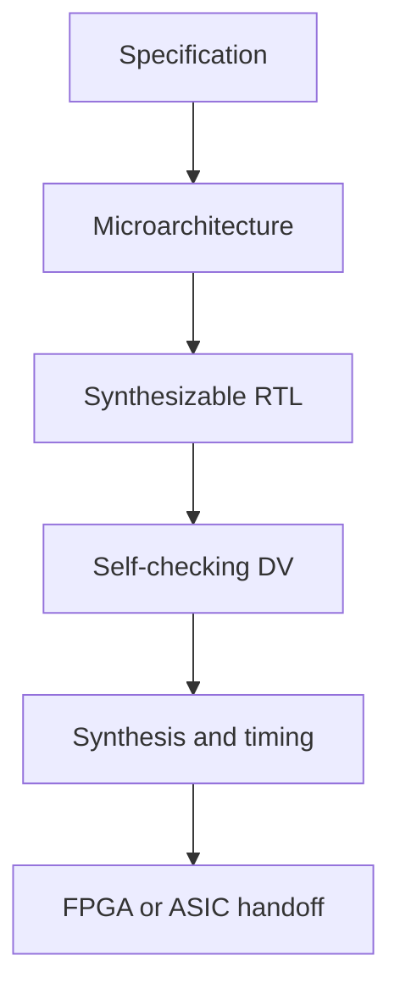

<h1 align="center">Pham Quoc Trung</h1>

  <strong>RTL Design · Design Verification · Digital IC & FPGA Systems</strong>

  Electronics and Telecommunications Engineering student at VNUHCM – University of Science,
  building specification-driven and verifiable digital hardware.

  
  

## Engineering profile

I focus on the point where architecture becomes trustworthy RTL: clarifying the specification, defining cycle-accurate behavior, partitioning the microarchitecture, writing synthesizable SystemVerilog, and verifying normal, boundary, reset, and error scenarios.

My project path progresses from arithmetic blocks and FSMs to FIFOs, RISC-V processors, pipelined datapaths, and SoC-level CPU/DMA integration.

| Focus area | Current practice |
|---|---|
| RTL design | Verilog/SystemVerilog, combinational and sequential logic, FSMs, pipelining, parameterized IP |
| Design verification | Self-checking testbenches, reference models, scoreboards, assertions, functional corner cases, waveform debug |
| Computer architecture | RV32I datapath/control, memory systems, MMIO, DMA, AXI integration |
| CDC and reset | Gray-code pointer crossing, two-flop synchronization, asynchronous assertion and synchronous release |
| Implementation | Quartus, Questa/ModelSim, Yosys/OpenSTA entry flows, SDC, FPGA prototyping |
| Software support | C/C++, Python, bare-metal firmware, host-side test automation |

## Selected projects

| Project | RTL / architecture | Verification evidence |
|---|---|---|
| [16×16 Wallace Tree Multiplier](https://github.com/trungpham141205/Wallace_Tree_Multiplier_16x16_Pipeline_3_Stage) | Three-stage carry-save reduction pipeline with a 32-bit final adder | Queue scoreboard; committed Questa run checks 1,488 transactions with 0 errors |
| [RV32I Single-Cycle CPU](https://github.com/trungpham141205/RV32I_Single_Cycle) | Modular SystemVerilog RV32I datapath, control, memories, and software-driven integration | Unit regressions plus committed integrated result of 10 PASS / 0 FAIL |
| [RV32I + AXI DMA SoC](https://github.com/trungpham141205/SoC-RV32I-CNN-) | RV32I CPU, memory-mapped DMA control, shared AXI RAM, and bare-metal firmware | Self-checking CPU + DMA + RAM integration flow |
| [Asynchronous FIFO](https://github.com/trungpham141205/Asynchronous_FIFO_Gray_Code_Point) | Dual-clock FIFO with Gray pointers and domain-local reset release | RTL and functional specification; verification environment is the next milestone |
| [Synchronous FIFO](https://github.com/trungpham141205/Synchronous_FIFO) | Parameterized single-clock FIFO with explicit boundary semantics | Written verification plan covering reset, wrap, simultaneous access, overflow, and underflow |

## How I approach a hardware block

The goal is not only to make a waveform look correct. I aim to make assumptions, interface rules, latency, reset behavior, CDC boundaries, verification gaps, and implementation evidence visible enough for another engineer to review.

## Current direction

- Deepening RTL design and Design Verification practice through reusable testbench components and assertion-based checks.
- Developing timing-aware datapaths and clean pipeline interfaces.
- Extending CPU, DMA, accelerator, and shared-memory work toward a more complete SoC flow.
- Building toward full ASIC implementation literacy from RTL handoff through synthesis, STA, and physical-design collaboration.

## Contact

- [Interactive hardware portfolio](https://trungpham141205.github.io/portfolio/)
- [GitHub repositories](https://github.com/trungpham141205?tab=repositories)

I am open to RTL Design, Digital IC Design, Design Verification, FPGA/SoC collaboration, internship, and research opportunities.
